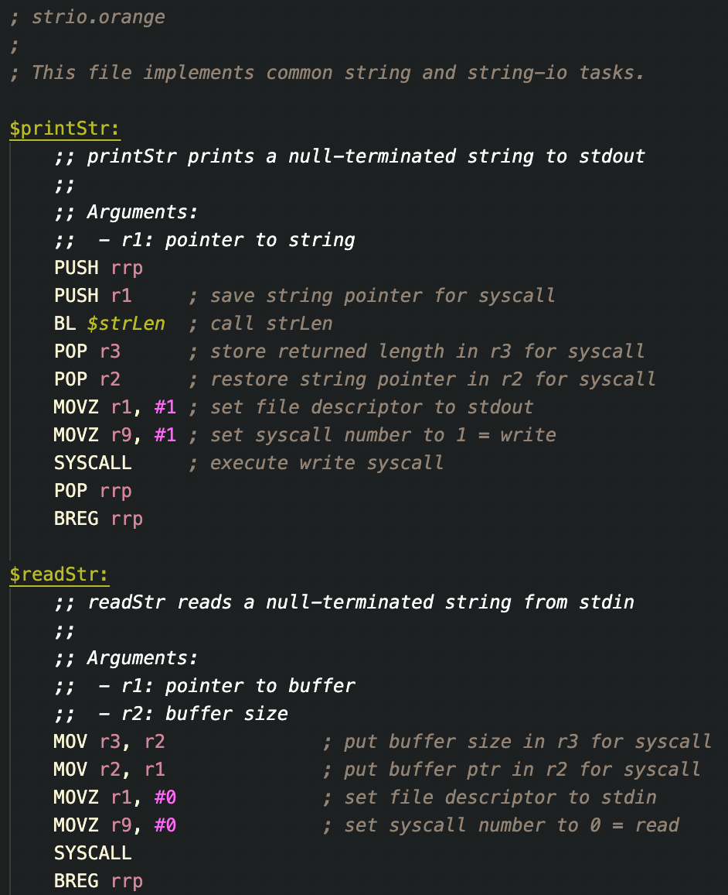
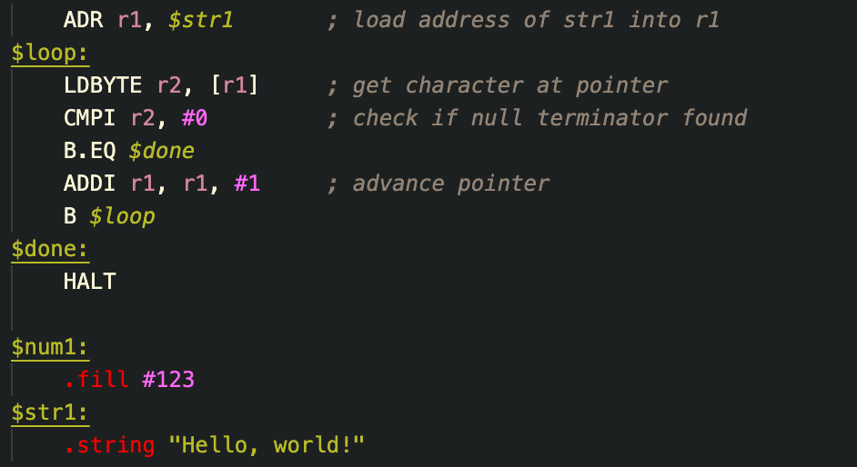

# orange-lang-vscode

This extension adds syntax highlighting for the [Orange](https://github.com/dnsge/orange) assembly language.

## Screenshots

One example of syntax highlighting:

Other example of syntax highlighting:

